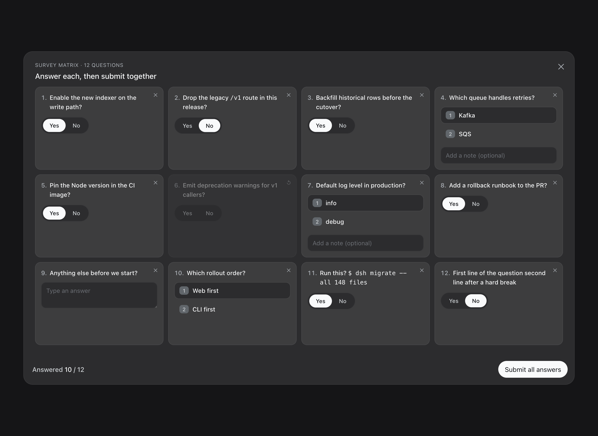
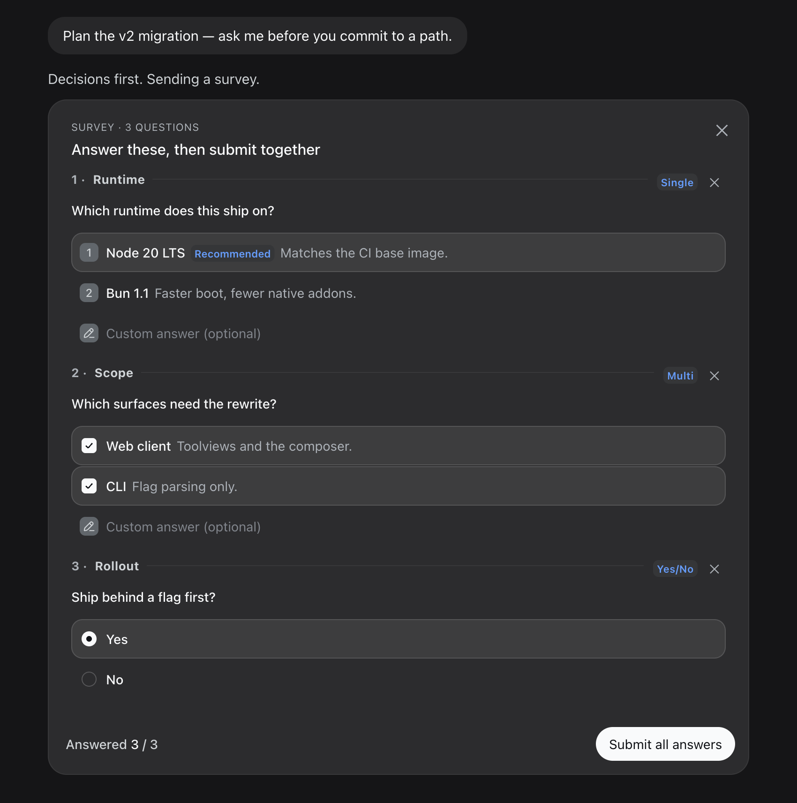
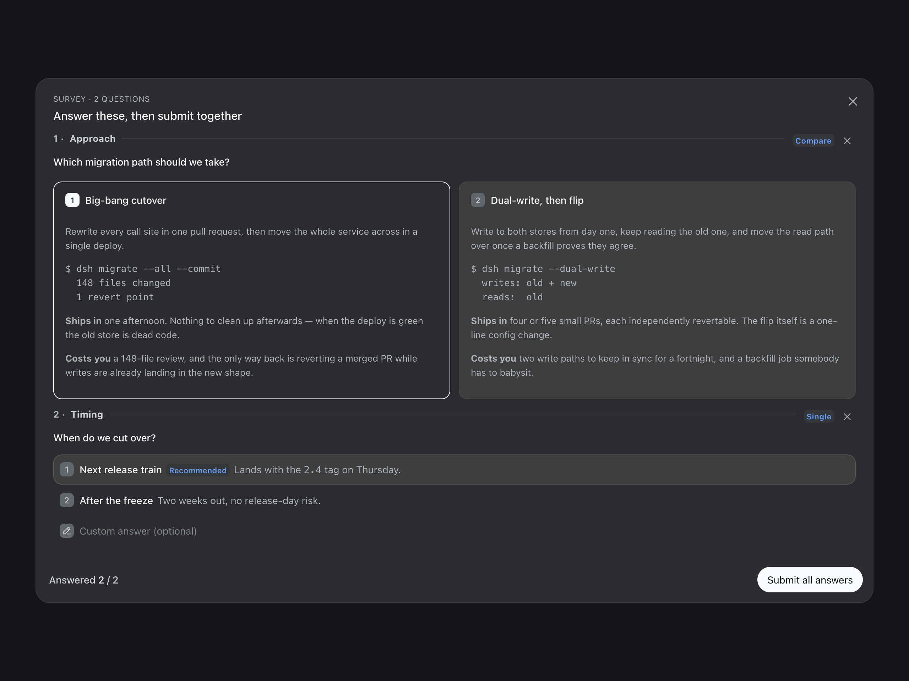
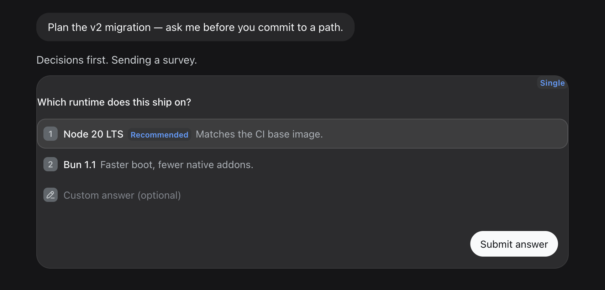

# dsh-survey

Ask the user ten questions at once instead of ten times in a row.

`do_a_survey` is a tool plugin for [DeepSeek Harness](https://github.com/deepseek-ai/DeepSeek-Harness). The model sends a whole questionnaire; the user answers it in one card and submits once.

[](LICENSE)
[](https://github.com/topics/dsh-plugin)
[](README.zh.md)

<div align="center">

| Single | Multi | Yes/No | Compare | Open |
|---|---|---|---|---|
| Numbered rows | Checkbox | Radio pair | Side-by-side blocks | Multi-line input |

</div>

## When you'd want this

- **The agent needs five decisions before it can start.** Without this it asks
  one, waits, asks the next — five round trips before any work happens. Here it
  asks once and you answer the lot in a single card.
- **You want the answers back as data, not prose.** Each reply arrives as
  `{ id, selected, custom?, skipped? }`, so the model never has to parse "yeah
  the first one, and skip the last question" out of a sentence.
- **Some of it you genuinely don't care about.** Every question has a skip, so
  a survey that asks more than you want to answer costs you a click, not a
  negotiation.

When the model calls `do_a_survey`, the Web UI renders the survey by `mode`:

- `compact` — single-question card
- `inline` — embedded in the conversation column
- `overlay` — fullscreen, for compare questions
- `grid` — matrix of many simple questions

All text supports Markdown (code blocks, blockquotes, inline code, bold) and color (`{color:red}text{/color}`). A readable two-column recap follows the submit.

## Preview

Screenshots of the real toolview, captured from the shipped bundle.

**Grid matrix** — fullscreen overlay for many simple questions, one card each:



**Inline** — survey embedded in the conversation column, filled and submitted together:



**Overlay compare** — fullscreen side-by-side comparison with Markdown:



**Compact** — single-question card with rich question types:



## Install

**Bundle plugin (recommended, resident)** — build artifacts are committed, one-line install:

```sh
dsh plugin --profile web add "github:jinhuang712/dsh-survey#main"
# restart dsh web, then refresh the page
```

Local directory install (when you have the source):

```sh
git clone https://github.com/jinhuang712/dsh-survey.git
cd dsh-survey
dsh plugin --profile web add .
# restart dsh web, then refresh the page
```

After install, the `do_a_survey` tool and its survey UI are available permanently.

The companion skill `dsh-survey` registers with the install (`dsh.skills` declaration):

- a usage guide covering the four modes and five question types
- a dynamic-plugin fallback recipe (`references/dynamic-plugin-fallback.md`) for environments without the bundle

## Usage

Tell the model what you want to collect; it calls `do_a_survey(mode, questions)`. `mode` is required:

| mode | When | Presentation |
|---|---|---|
| `"compact"` | Exactly 1 question | Compact single-question card |
| `"inline"` | Multiple questions, no compare | Embedded in the conversation column |
| `"overlay"` | Compare questions or wide canvas | Fullscreen overlay (1180px) |
| `"grid"` | Many simple questions (yes/no, single) | Fullscreen grid matrix, one card each |

Example:

```json
{
  "mode": "inline",
  "questions": [
    {
      "id": "q1",
      "header": "Runtime",
      "question": "Which runtime does this ship on?",
      "options": [
        { "label": "Node 20 LTS (recommended)", "description": "Matches the CI base image." },
        { "label": "Bun 1.1", "description": "Faster boot, fewer native addons." }
      ]
    },
    { "id": "q2", "header": "Scope", "question": "Which surfaces need the rewrite?", "multi_select": true, "options": [{ "label": "Web client" }, { "label": "CLI" }] },
    { "id": "q3", "kind": "boolean", "question": "Ship behind a flag first?" },
    { "id": "q4", "header": "Notes", "question": "Anything the changelog should call out?" }
  ]
}
```

`header` is an optional short heading shown beside the question number. A trailing `(recommended)` on a label becomes a badge.

### Question types

| Type | Trigger | UI | Answer |
|---|---|---|---|
| Single | `options` + no `multi_select` | Numbered rows (1 / 2 / 3) | The chosen option's label |
| Multi | `options` + `multi_select: true` | Checkbox | Every chosen label, in option order |
| Yes/No | `kind: "boolean"` | Radio pair; segmented toggle in grid (omit `options`) | `"yes"` or `"no"` |
| Compare | `kind: "compare"` + `compare: {left: {title,text}, right: {title,text}}` | Side-by-side blocks (overlay recommended) | `"left"` or `"right"` |
| Open | no `options`, not boolean/compare | Multi-line input | Empty `selected`, body in `custom` |

Each answer is `{ id, selected, custom?, skipped? }`. Question ids must be unique within one survey, and a survey nobody submits within 30 minutes fails on timeout rather than hanging the call.

### Features

- **Full Markdown** — question text, option labels/descriptions, compare blocks and recap all render through the official safe renderer
  - micromark + protocol allowlist + shiki highlighting
  - code blocks, blockquotes, inline code, bold
- **Color** — `{color:red}text{/color}` (named / `#hex` / `rgb()`), usable in questions, options, compare blocks
- **Skip / restore** — per-question ✕ grays out, ↺ restores; submitted as `skipped: true`
- **Fullscreen overlay** — `mode: "overlay"` centers fullscreen (mask + 1180px), breaking past the 748px conversation column
- **Grid matrix** — `mode: "grid"` fullscreen grid of many simple questions
  - every card is the same size, controls sit under the question, per-card skip
  - card text is inline-only: a fenced block collapses to inline code and hard breaks to spaces, so one long question cannot blow open the whole matrix
  - compare questions degrade to a left/right choice
- **Readable recap** — strict two-column grid, one "question → answer" row each
- **Follows your language** — card copy ships in English and Chinese, tracking the Web UI's language setting
  - falls back to the browser's language where that setting is unavailable
  - answers stay language-neutral, so switching never changes what the model receives
- **Accessibility** — radio/checkbox semantics + keyboard focus rings

## Architecture

- **Host half** (`lib/index.mjs`): Cordis entry
  - `defineTool` registers `do_a_survey` with a 30-minute `timeoutMs`
  - `webServer.register` serves `/api/dsh-survey/submit|cancel`
  - `execute` suspends on the answer, correlated by `exec.callId`; submit, cancel, abort, timeout and unload each release it
- **Client half** (`src/` → `lib/client.js`): `__ModuleLoader__.load` bundle registering `tool.call.toolview` key=`do_a_survey`
  - `runtime.js` binds the host's React and UI primitives from the loader's `require` — they are never bundled, so the plugin shares the host's React instance
  - `styles.css` the stylesheet, injected once per page
  - `i18n.js` zh/en copy, `markdown.js` Markdown and colour, `answers.js` pick ↔ answer mapping
  - `controls.js` the answer controls, `model.js` draft state and submit/cancel
  - `modes/` one file per presentation: `compact`, `survey` (inline + overlay), `grid`, `recap`
- **Skill** (`skills/dsh-survey/SKILL.md`): usage guide + dynamic-plugin fallback recipe (`references/dynamic-plugin-fallback.md`)

### Develop

`lib/client.js` and its source map are build output, committed so the GitHub install stays one line. Edit `src/`, then:

```sh
pnpm install
pnpm build      # esbuild src/index.js -> lib/client.js + lib/client.js.map
```

The host serves the map at `/plugins/dsh-survey/client.js.map`, so breakpoints land in `src/`.

## Verify

- After install, `__DSH_BOOT__` should include the `dsh-survey` client row; `/plugins/dsh-survey/client.js` returns 200
- `cordis_inspect_query` (Tool.listTools) should show `do_a_survey`
- Run a 4-6 question survey (with markdown + color text) and check all four modes

## Uninstall

- Remove the `dsh-survey` insert row from the web profile's `cordis.patch.yml`
- Remove the `dsh-survey` dependency from the web profile's `dsh.profile.bundles` and run `pnpm remove`

## License

MIT
